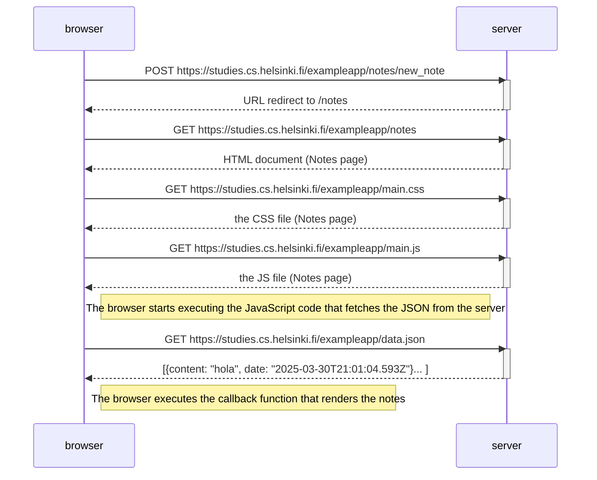

```mermaid
sequenceDiagram
    participant browser
    participant server

    browser->>server:  POST https://studies.cs.helsinki.fi/exampleapp/notes/new_note
    activate server
    server-->>browser: URL redirect to /notes
    deactivate server


    browser->>server: GET https://studies.cs.helsinki.fi/exampleapp/notes
    activate server
    server-->>browser: HTML document (Notes page)
    deactivate server

    browser->>server: GET https://studies.cs.helsinki.fi/exampleapp/main.css
    activate server
    server-->>browser: the CSS file (Notes page)
    deactivate server

    browser->>server: GET https://studies.cs.helsinki.fi/exampleapp/main.js
    activate server
    server-->>browser: the JS file (Notes page)
    deactivate server

    Note right of browser: The browser starts executing the JavaScript code that fetches the JSON from the server

    browser->>server: GET https://studies.cs.helsinki.fi/exampleapp/data.json
    activate server
    server-->>browser: [{content: "hola", date: "2025-03-30T21:01:04.593Z"}... ]
    deactivate server

    Note right of browser: The browser executes the callback function that renders the notes


```