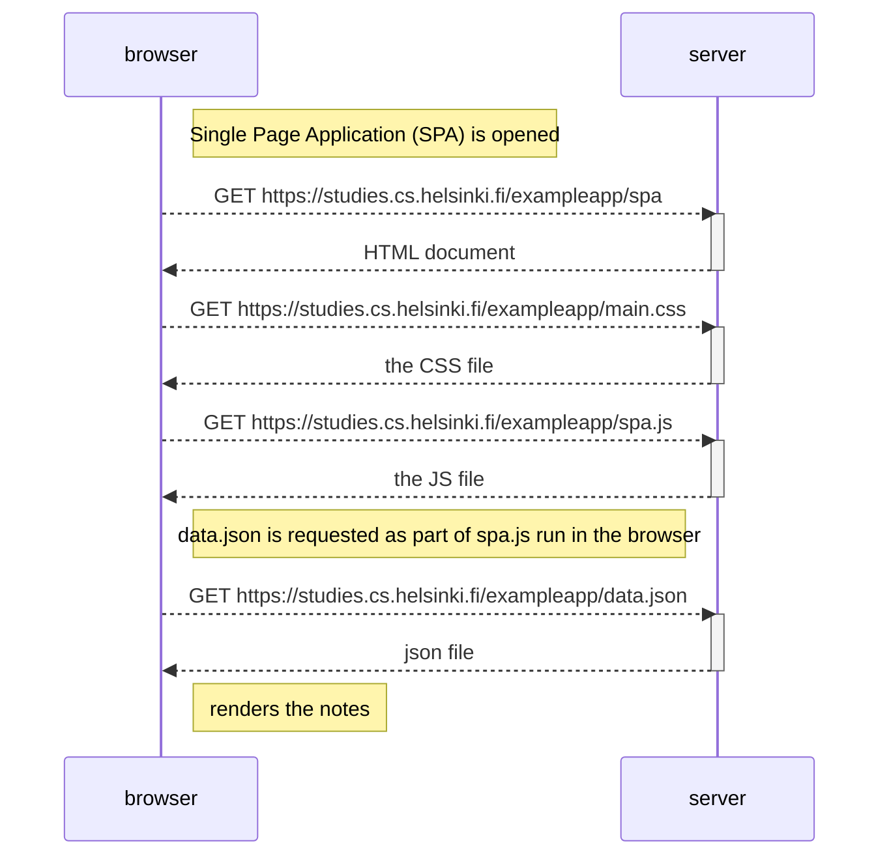

```mermaid

sequenceDiagram
    participant browser
    participant server

    Note right of browser: Single Page Application (SPA) is opened
    browser-->>server: GET https://studies.cs.helsinki.fi/exampleapp/spa
    activate server
    server-->>browser: HTML document
    deactivate server

    browser-->>server: GET https://studies.cs.helsinki.fi/exampleapp/main.css
    activate server
    server-->>browser: the CSS file
    deactivate server

    browser-->>server: GET https://studies.cs.helsinki.fi/exampleapp/spa.js
    activate server
    server-->>browser: the JS file
    deactivate server

    Note right of browser: data.json is requested as part of spa.js run in the browser

    browser-->>server: GET https://studies.cs.helsinki.fi/exampleapp/data.json
    activate server
    server-->>browser: json file
    deactivate server

    Note right of browser: renders the notes


```